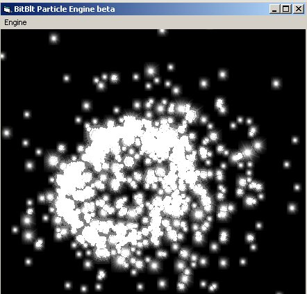



## Bitblt Particle engine test

### Description

A highly configurable variable particle engine that uses bitblt to buffer and render graphical particles. Global and particle forces as well as gravity push the particles to whatever destination you wish. This is a work in progress and may be seen in one of my future VB games. I did the best I could to comment it so you should be able to understand it.

Move the mouse and the particle emitter moves with you, a neat effect to show the potential applications of this engine.
 
### More Info
 

             |
---                |---
**Submitted On**   |2002-12-23 06:32:16
**By**             |[Tecc](https://github.com/Planet-Source-Code/PSCIndex/blob/master/ByAuthor/tecc.md)
**Level**          |Advanced
**User Rating**    |4.8 (81 globes from 17 users)
**Compatibility**  |VB 6\.0
**Category**       |[Graphics](https://github.com/Planet-Source-Code/PSCIndex/blob/master/ByCategory/graphics__1-46.md)
**World**          |[Visual Basic](https://github.com/Planet-Source-Code/PSCIndex/blob/master/ByWorld/visual-basic.md)
**Archive File**   |[Bitblt\_Par15172912232002\.zip](https://github.com/Planet-Source-Code/tecc-bitblt-particle-engine-test__1-41792/archive/master.zip)

